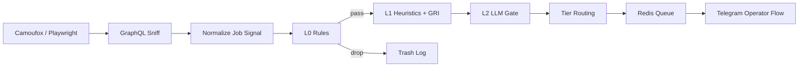

# GHOST_ENGINE

The industry is full of "automation" that breaks on the first UI redesign.  
`GHOST_ENGINE` is the opposite: not a demo bot, but an engineering pipeline with browser ingestion, cascade scoring, OPSEC gates, and controlled execution routing.

This is a showcase version for portfolio use: no private data, but real architecture and real code.

---

## What the system does

- Collects signals from job platforms via browser automation (`Camoufox + Playwright`).
- Normalizes raw payloads into a unified `job_signal`.
- Runs leads through `L0 -> L1 -> L2` with fail-fast logic.
- Computes `GRI` (Ghost ROI Index) and assigns `job_tier` (`TRASH`, `MANUAL_REVIEW`, `ZERO_TOUCH`).
- Pushes only qualified items into the operator loop (Redis + Telegram).
- Protects generative stages with sanitizer, LLM firewall, and hard guards.

---

## Why this is not "just another script"

- **Single scoring engine**: one `ScoringEngine` reused across flows with no logic drift.
- **Config-driven rules**: thresholds, vetoes, and routing live in YAML, not hardcoded everywhere.
- **Fail-fast economy**: expensive stages run only after cheap filters pass.
- **Separation of concerns**: sniffing, scoring, routing, negotiation, and ops are modularized.
- **Security-first**: inbound text/data is treated as untrusted by default.

---

## High-level architecture



---

## Tech stack

- `Python 3.12`
- `Camoufox + Playwright`
- `LangGraph` (pipeline orchestration)
- `Redis` (queues, signaling, operator control)
- `PostgreSQL + SQLAlchemy` (data model, analytics, state)
- `Ollama` (local LLM tasks, including safety/fit-judge)
- `structlog`, `httpx`, `pydantic-settings`, `PyYAML`, `aiogram`

---

## Core modules

- `src/ghost_engine/adapters/` - browser ingest, sniff, platform adapters.
- `src/ghost_engine/scoring/` - L0/L1/GRI, safety, routing policy.
- `src/ghost_engine/agents/` - graph orchestration and node-level logic.
- `src/ghost_engine/notify/` - unified notification contract and dedupe.
- `src/ghost_engine/telegram/` - operator interface.
- `config/` - rules, thresholds, and execution modes.

---

## Quick start (local)

```bash
cd GHOST_ENGINE_showcase
cp .env.example .env
uv sync --group dev
```

Base commands:

```bash
# browser session
uv run python -m ghost_engine.browser.dev_session --site upwork --profile default

# telegram worker
uv run python -m ghost_engine.main telegram-bot

# tests
uv run pytest
```

---

## OPSEC and scope

- This repository is a defensive engineering showcase.
- Secrets, accounts, runtime traces, and private datasets are removed.
- Incoming text/data is handled as untrusted input.
- Production automation must operate within platform ToS and legal boundaries.

---

## Resume value of this project

- Designing resilient browser automation for hostile and changing UI surfaces.
- Building cascade decisioning (`L0/L1/L2`) with LLM cost control.
- Policy-driven routing via `job_tier` and risk gates.
- Implementing an operator control plane (Redis + Telegram).
- Applying practical DevSecOps patterns: sanitize, auditability, fail-safe behavior.

---

## Documentation

- `docs/scoring_cascade.md` - cascade scoring and tier routing.
- `docs/opsec_pipeline.md` - sanitizer, firewall, hard guards.
- `docs/agent_graphs.md` - graph map and traversal logic.
- `docs/architecture_supplement.md` - architectural additions.
