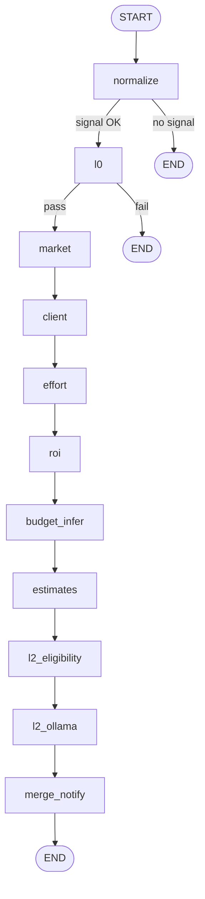
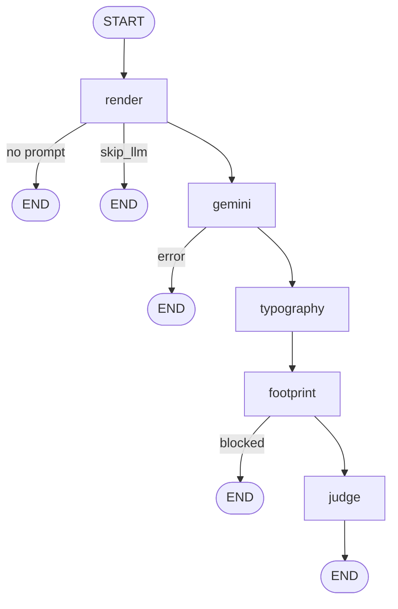

# Agent Graphs: no magic, only flow

If a graph is not transparent, it is not architecture, it is theater.  
In `GHOST_ENGINE`, graphs are built as engineering pipelines: every gate is explainable, logged, and reproducible.

Core principle: **cheap checks first, expensive reasoning last**.

---

## 1) Layout map

- Graph assembly: `src/ghost_engine/agents/graph.py`
- Scoring nodes: `src/ghost_engine/agents/nodes/scoring_analytics_nodes.py`
- Cover pipeline nodes: `src/ghost_engine/agents/nodes/cover_letter_pipeline_nodes.py`
- Graph registry: `src/ghost_engine/agents/graph_layout.py` (`GRAPHS`)
- Gate traversal reports:
  - `scoring/gate_ledger.py`
  - `scoring/cover_gate_ledger.py`
  - `ops/diag_gate_ledger.py`

---

## 2) Scoring graph (`GRI + L2`)

### Purpose

Do not burn LLM budget and operator time on junk.  
Filtering and economics first, semantics second.

### Entry points

- `build_scoring_graph`
- `ainvoke_scoring_graph`

### Routing handlers

- `route_after_scoring_normalize`
- `route_after_scoring_l0`

### Flow

### Gate semantics

- `normalize`: checks whether a valid signal exists at all.
- `l0`: hard YAML rules. Fail means immediate exit.
- `budget_infer`: optional node (`budget_llm_infer`), not mandatory.
- `l2_eligibility`: L2 is enabled only for gray-zone cases.
- `l2_ollama`: local LLM judge with fail-open behavior on unavailability.

### Observability

- Traversal report: `build_scoring_traversal_report`
- State field: `scoring_traversal`
- Core logs: `job.scoring_gate`, `scoring_traversal_summary`
- Exception path: `job.scoring_graph_failed` + mirror in `ops.errors`

---

## 3) Cover letter graph

### Purpose

Build a response draft without hallucinated garbage:  
render -> generation -> typography -> footprint -> safety judge.

### Entry points

- `build_cover_letter_graph`
- `ainvoke_cover_letter_graph`

### Flow

### Observability

- Traversal report: `build_cover_traversal_report`
- State field: `cover_pipeline_traversal`
- Adapter log key: `job.cover_pipeline_traversal`

---

## 4) Ops AI diagnosis (separate flow, same discipline)

This is not a LangGraph graph, but the discipline is the same: deterministic stages and explicit traversal reporting.

- Code: `src/ghost_engine/ops/ops_ai_diag.py`
- Report: `build_ops_diag_traversal_report`
- Log key: `ops_ai_diag.traversal`
- Stages: local text -> local vision (optional) -> Gemini text analysis

---

## 5) Legacy vs active path

- `agents/nodes/scoring_node.py` - legacy flat node (`L0/L1` without full GRI graph flow)
- The active adapter path uses `ainvoke_scoring_graph`
- State contract: `agents/state.py` (`AgentState`)

---

## 6) Why this matters in interview terms

- You can explain **where cost is burned** and **where risk is killed**.
- You can show **policy-driven routing**, not random if/else spaghetti.
- You can prove **traceability**: every dropped or routed item has a reason code and traversal footprint.
- You can defend reliability decisions: fail-fast, fail-open/fail-safe boundaries, and operator escalation points.
